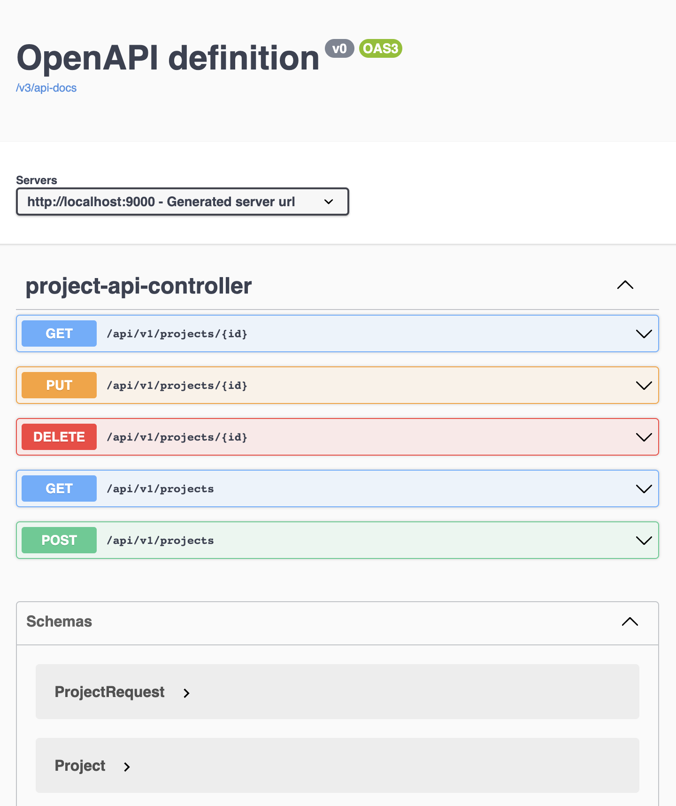

# CMS Frontend Test

## Introduction

Thank you for taking the time to do this home assignment. 
This test is designed to measure your skills as a
Fronted Developer in a way that resembles a real life scenario.

## Scenario

Our company is creating a ticketing system for our helpdesk operators.

For now is just a Proof-of-concept. 
The only entity that we have now is `Project`, later on we'll introduce other entities such as `Client` and `Ticket`

A `Project` is a simple entity that has three fields

| Name          | Type    | Description                  |
|---------------|---------|------------------------------|
| `id`          | Integer | A unique identifier, i.e. PK |
| `name`        | String  | Short name                   |
| `description` | String  | Long description             |

A `Project` represented as JSON looks like this:

```json
{
    "description": "Lorem ipsum dolor sit amet",
    "id": 1,
    "name": "Project 1"
}
```

Your task as a Frontend Developer is to create a basic CRUD UI, 
consuming a REST API that our backend developers provided for you.

## Prerequisites

- A GitHub account.
- Java JDK version 17 running on your machine.

## Instructions

### A private GitHub Repository

Create a private GitHub Repository for your project. 
Please add [MarioAriasCMS](https://github.com/MarioAriasCMS) to your project as a collaborator.

### Run the backend locally.

The following instructions assume that you're working on a *nix like OS such as Linux or macOS. 
If you're working with Windows, please adapt the instructions accordingly.

Try to run the command `java --version` to check that your Java JDK is on place:

```shell
java --version
```

You should see an output like this or equivalent:

```text
openjdk 17.0.6 2023-01-17
OpenJDK Runtime Environment Temurin-17.0.6+10 (build 17.0.6+10)
OpenJDK 64-Bit Server VM Temurin-17.0.6+10 (build 17.0.6+10, mixed mode)
```

Run the application with the command:

```shell
./gradlew bootRun
```

You should see and output like this.

```text
> Task :bootRun

  .   ____          _            __ _ _
 /\\ / ___'_ __ _ _(_)_ __  __ _ \ \ \ \
( ( )\___ | '_ | '_| | '_ \/ _` | \ \ \ \
 \\/  ___)| |_)| | | | | || (_| |  ) ) ) )
  '  |____| .__|_| |_|_| |_\__, | / / / /
 =========|_|==============|___/=/_/_/_/
 :: Spring Boot ::                (v3.0.4)

2023-03-09T09:30:37.506+08:00  INFO 60045 --- [           main] com.cms.tickets.TicketsApplicationKt     : Starting TicketsApplicationKt using Java 17.0.6 with PID 60045 (/Users/mario/repositories/tickets-frontend-test/build/classes/kotlin/main started by mario in /Users/mario/repositories/tickets-frontend-test)
2023-03-09T09:30:37.508+08:00 DEBUG 60045 --- [           main] com.cms.tickets.TicketsApplicationKt     : Running with Spring Boot v3.0.4, Spring v6.0.6
2023-03-09T09:30:37.508+08:00  INFO 60045 --- [           main] com.cms.tickets.TicketsApplicationKt     : No active profile set, falling back to 1 default profile: "default"
2023-03-09T09:30:38.250+08:00  WARN 60045 --- [           main] o.s.b.a.f.FreeMarkerAutoConfiguration    : Cannot find template location(s): [classpath:/templates/] (please add some templates, check your FreeMarker configuration, or set spring.freemarker.check-template-location=false)
2023-03-09T09:30:38.302+08:00  INFO 60045 --- [           main] o.s.b.web.embedded.netty.NettyWebServer  : Netty started on port 9000
```

The server will run in the port 9000.

Now you can open the Swagger UI [http://localhost:9000/swagger-ui.html](http://localhost:9000/swagger-ui.html)



Test all the endpoints, get familiar with the API. There are some example data preloaded.
 

### Working on your project.

Your task is to create a CRUD Web application, 
using any Framework or library that you want (Bonus points if you use React but isn't mandatory)

The users must be able to:

- Create new projects
- List all the projects
- Update existing projects
- Delete existing projects

Once you're happy with your project, push all your changes to the private repository and let's know via email.

### Deliverables

We expect from you:

- A well-designed working CRUD application
- Well documented
- With automatic testing (Unit, Behaviour, UI or others)
- With clear instructions on how to run the tests and the application. (Assume that the person running and testing your application isn't a frontend expert)

## Evaluation criteria

| Criteria               | Explanation                                                                                                      |
|------------------------|------------------------------------------------------------------------------------------------------------------|
| Does it look good?     | We understand that you aren't a graphic designer, but you know how to use CSS in a consistent and logical manner |
| Is easy to use?        | You have a good sense of UX                                                                                      |
| It has tests?          | You know and use good development practices                                                                      |
| It is well coded?      | Your code is well documented, logical and consistent, is maintainable and easy to extend if needed               |

